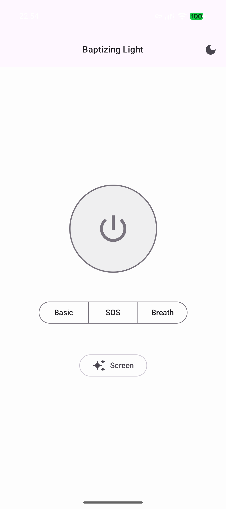
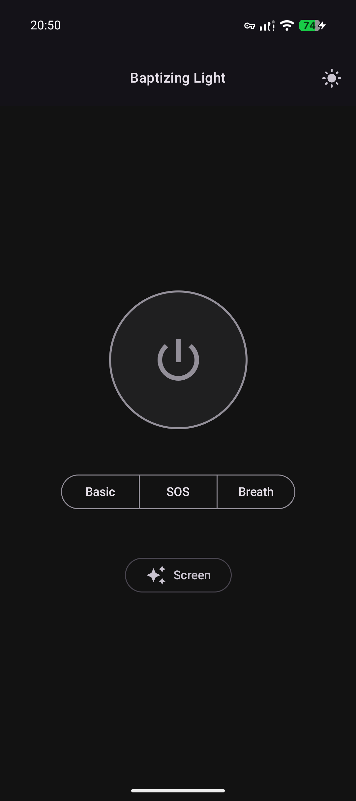
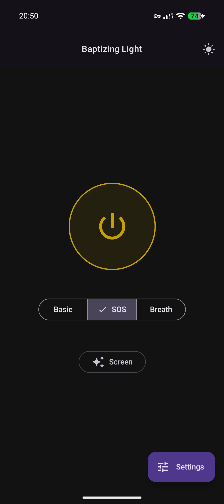
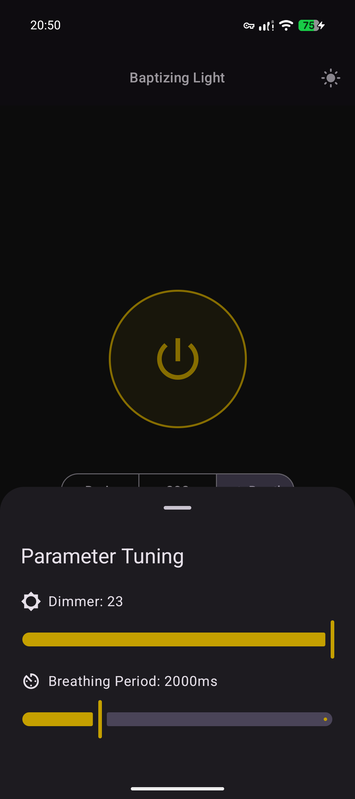

# 🔦 BaptizingLight
> **Advanced Android Flashlight HAL & State Sync Engine**

A high-performance, industrial-grade Android Flashlight application built with Site Reliability Engineering (SRE) principles. This project focuses on extreme stability, sub-millisecond responsiveness, and seamless state synchronization between the System Quick Settings Tile and the main Application.

## 🚀 Key Features
- **Advanced HAL (Hardware Abstraction Layer):** Custom implementation using Camera2 API with support for high-level torch strength (API 33+).
- **SSOT State Management:** Uses **Kotlin Coroutines & Flow** to maintain a "Single Source of Truth," ensuring the Quick Settings Tile and App UI are always in sync.
- **SRE Guardrails:** * **Mutex-Locked Hardware Access:** Prevents race conditions and hardware deadlocks during rapid switching.
  - **Memory Leak Protection:** Singleton-based service scope tied to the Application lifecycle.
  - **Self-Healing Logic:** Automatic coroutine scope recovery and hardware error interception.
- **Special Modes:** Includes precision-timed **SOS (Morse Code)** and **Breathing Light** effects.

## 🛠️ Technical Architecture
### 1. Cold Start Optimization (The "Instant-On" Strategy)
   Standard Camera2 implementations suffer from a 300ms+ delay during `cameraIdList` enumeration. **BaptizingLight** implements an optimistic UI pattern:

1. **Async Validation:** Triggers a background hardware check to verify the ID while the light is already being toggled.

2. **Visual First:** Updates the UI/Tile state on the first frame of the click event.

### 2. Concurrency Model
   The project utilizes a custom `CoroutineScope` with a `SupervisorJob` and `Dispatchers.Main.immediate`.

- **Atomic Mode Switching:** Every mode change follows a "Cancel-and-Join" pattern to ensure no two hardware tasks (e.g., SOS and Manual) ever compete for the Camera HAL.
- **Hardware Mutex:** A `kotlinx.coroutines.sync.Mutex` ensures that rapid-fire clicks from the user are linearized.

### 3. Synchronization Flow
   The App utilizes a bi-directional sync strategy:

- **Tile → Service:** `TileService` acts as a thin client, dispatching intents to the singleton `FlashlightService`.

- **Service → App UI:** The `MainActivity` observes a `StateFlow` from the service, ensuring the slider and toggle buttons reflect reality, even if the light was turned off via the notification shade.

## 🏗️ Requirements
- **Minimum SDK:** Android 7.0 (API 24)
- **Target SDK:** Android 16 (API 36)
- **Language:** 100% Kotlin
- **Asynchronous:** Kotlin Coroutines & Flow
- **Build System:** Gradle (Kotlin DSL)

## 👓 Screenshots
|                     Light Theme                      |            Dark Theme            |
|:----------------------------------------------------:|:--------------------------------:|
|    |  |
|                                                      |  |
|                                                      |  |
|  |  |
